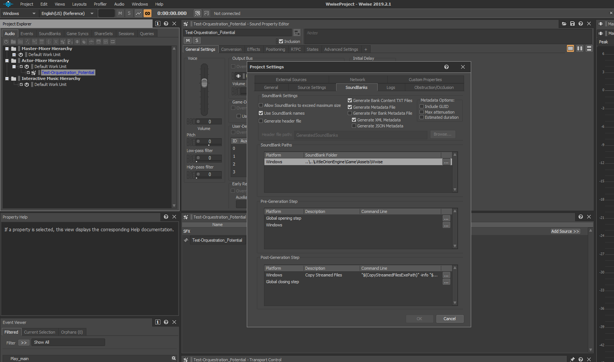

# WWiseProject
TwinlightSoul Wwise project

In order to open this project you should download Wwise launcher here https://www.audiokinetic.com/download/ and get a free license.

# Usage

For quick usage guide use this https://www.audiokinetic.com/learn/videos/?course=wwise101 we will be using Method 2 for SoundBank generations created here: https://www.audiokinetic.com/library/edge/?source=SDK&id=sdk_bank_training.html

In order to use this project in your game with LittleOrionEngine, follow this steps:

- Clone this repository, preferably at same folder level where LittleOrionEngine is located.
- Open the project with Wwise launcher.
- Once the project is open go to Project->Project settings..
- Set the SoundBanks path in the settings to the Assets folder in your game:

